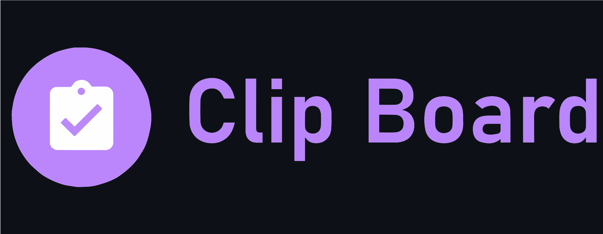
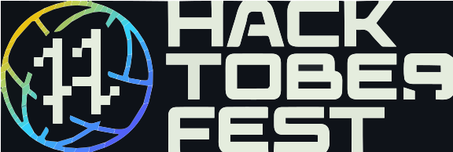

  

<h3 align="center">CLIPBOARD</h3>

   
  
  

---

<h2 align="center"> A web based clipboard.
      
</h2>

## 📝 Table of Contents
- [About](#about)
- [Getting Started](#getting_started)
- [Installation](#installation)
- [Built Using](#built_using)
- [ToDo](#todo)
- [Authors](#authors)
- [Acknowledgments](#acknowledgement)

## 🧐 About 
The simplest method for transmitting data across internet-connected devices

## 🏁 Getting Started 
> Current preview is available [here](https://djabrj.gq/).

## ⚙️Installation 
1. Clone this repository (e.g. `git clone https://github.com/fadkeabhi/CLIPBOARD`)
2. Copy config.sample.php to config.php (`cp config.sample.php config.php`)
3. Set up your own database credentials in config.php
4. Import `clips.sql` into the database (e.g. `mysql -uroot clipboard < clips.sql`)

## ⛏️ Built Using 
- [HTML](https://html.com/) - Frontend
- [CSS](https://developer.mozilla.org/en-US/docs/Web/CSS) - Frontend
- [JS](https://www.javascript.com/) - Frontend
- [PHP](https://www.php.net/) - Server Environment
- [SQL](https://www.mysql.com/) - Database

## 🆕 Whats New (v1.23.3.1) 
- Added support for API
- Created new [React based Homepage](react_homepage/index.html)

## ToDo 
- [x] improve style
- [x] add limit changer
- [ ] user login system with private clips
- [x] add theme switcher
- [x] add more themes
- [x] Create api support
- [x] Make React based homepage

## ✍️ Authors 
- [fadkeabhi](https://github.com/fadkeabhi) - Idea & Initial work

See also the list of [contributors](https://github.com/fadkeabhi/CLIPBOARD/graphs/contributors) who participated in this project.

## 🎉 Acknowledgements 
- Hat tip to anyone whose code was used

 
 

 <h3> <b>All Contributions are appreciated </b> </h3>
  
 &nbsp;&nbsp;&nbsp;&nbsp;&nbsp;
        &nbsp;&nbsp;&nbsp;&nbsp;&nbsp;
        
      

