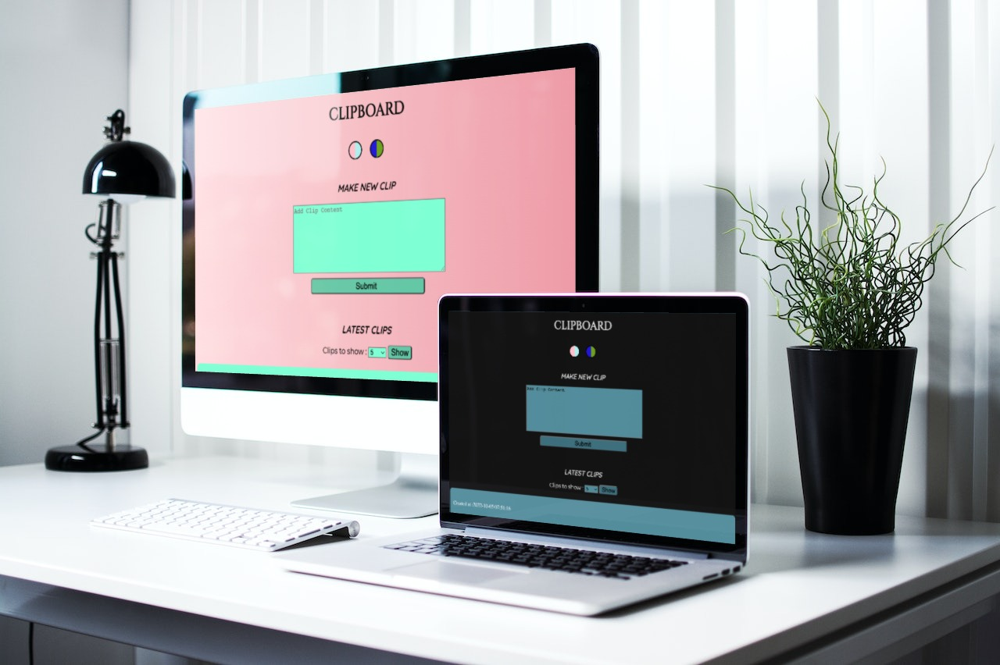

# CLIPBOARD
A web based clipboard.

The simplest method for transmitting data across internet-connected devices

 

> Current preview is available [here](https://djabrj.gq/).

 
 

# Features
- Multiple Themes
- Interactive
- Share information among all devices

 
 

# Techstacks
- PHP
- CSS
- HTML
- JS
- SQL

 
 

# Installation

1. Clone this repository 
(e.g. `git clone https://github.com/fadkeabhi/CLIPBOARD`)

2. Copy config.sample.php to config.php (`cp config.sample.php config.php`)

3. Set up your own database credentials in config.php

4. Import `clips.sql` into the database (e.g. `mysql -uroot clipboard < clips.sql`)

 

# To Do

- [x] improve style
- [x] add limit changer
- [ ] user login system with private clips
- [x] add theme switcher
- [ ] add more themes

 

# Preview
<a alt="Bruno Castro" target="_blank" rel="noopener noreferrer" href="https://my-trips.brunocastro.dev">Click here to preview</a>

 

# Layout

    

 
 

 <h4> <b>All Contributions are appreciated </b> </h4>
  
 &nbsp;&nbsp;&nbsp;&nbsp;&nbsp;
        &nbsp;&nbsp;&nbsp;&nbsp;&nbsp;
        
      

